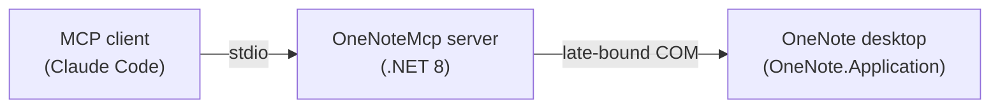

# OneNoteMcp

A [Model Context Protocol](https://modelcontextprotocol.io) server that exposes
Microsoft OneNote (desktop) to MCP clients such as Claude Code. It talks to
OneNote through late-bound COM on Windows, so the OneNote desktop app must be
installed.

> **Status:** scaffold (plan P-0526). Only the placeholder `onenote_diagnostics`
> tool is implemented; the full tool surface lands in later plans.

## Architecture



## Requirements

- Windows with the OneNote **desktop** app installed
- .NET 8 SDK (or newer SDK able to target `net8.0`)

## Build & test

```powershell
dotnet build
dotnet test
```

## Register with Claude Code

Build once, then add this to your project's `.mcp.json` (adjust the path):

```json
{
  "mcpServers": {
    "onenote": {
      "command": "dotnet",
      "args": ["run", "--project", "src/OneNoteMcp/OneNoteMcp.csproj"]
    }
  }
}
```

Or run the published binary directly:

```json
{
  "mcpServers": {
    "onenote": {
      "command": "path\\to\\OneNoteMcp.exe"
    }
  }
}
```

## Tools

| Tool | Description |
| --- | --- |
| `onenote_diagnostics` | Returns server diagnostics (scaffold: server version only). |

The full v1 tool catalog (hierarchy, page read/write, extraction, CRUD, export,
format conversion) is delivered by plans P-0527 – P-0538.

## License

[MIT](LICENSE)
