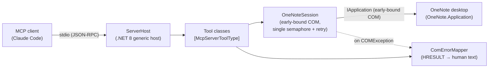
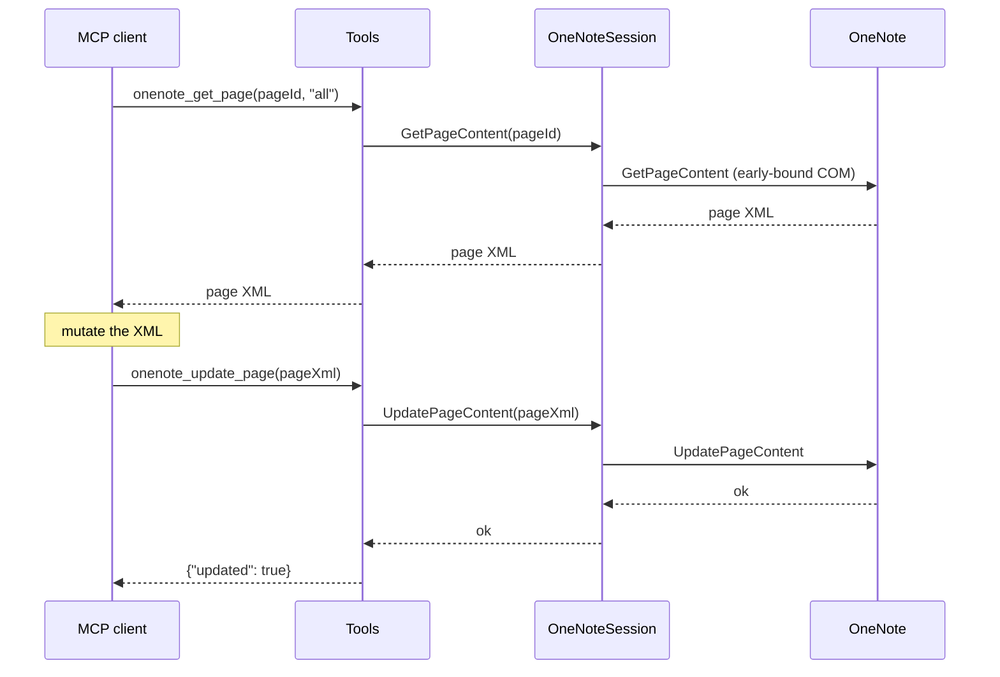

# OneNoteMcp

A [Model Context Protocol](https://modelcontextprotocol.io) server that exposes
Microsoft OneNote (desktop) to MCP clients such as Claude Code. It drives OneNote
through the **early-bound** OneNote COM automation API on Windows, so the OneNote
desktop app must be installed and able to run.

> **Status:** v1 tool surface complete — 21 tools covering diagnostics, hierarchy
> discovery, page read/write, file extraction, notebook/section/page CRUD, and
> PDF/`.one`/`.onepkg` export plus format detection & conversion.

## Architecture

The server is a .NET 8 generic host. It speaks MCP over **stdio** (stdout is
reserved for the protocol; all logs go to stderr). Tools are plain static
methods discovered by attribute and registered automatically. Every COM-touching
call funnels through a single `OneNoteSession` that serialises access to OneNote,
retries transient RPC failures, and recreates the connection if OneNote dies.



A page round-trip edit (read → mutate → write) flows like this:



## Requirements

- Windows with the OneNote **desktop** app installed (the classic Win32
  `OneNote.Application` COM server — not the Store/UWP "OneNote for Windows 10").
- .NET 8 SDK (or a newer SDK able to target `net8.0-windows`). The projects use
  `<RollForward>Major</RollForward>`, so a OneNote-side COM server started under a
  newer runtime works too.

## Build & test

```powershell
dotnet build OneNoteMcp.sln
dotnet test OneNoteMcp.sln
```

The integration tests build a fixture notebook in `%TEMP%` via COM and tear it
down per run. To require live COM (fail loudly instead of skipping when OneNote
is unavailable), set `ONENOTE_COM_REQUIRED=1` before `dotnet test`.

## Install from a GitHub Release (no .NET required)

The quickest path: download the self-contained Windows build and point Claude at
it. No .NET SDK, no source checkout, no container.

> This server drives OneNote through **COM**, so it must run as a native process
> on the same Windows desktop where OneNote is installed. That is why it ships as
> a downloadable `.exe` rather than a `docker run ghcr.io/...`-style image — a
> container cannot reach the host's OneNote COM server.

1. Download `OneNoteMcp-v1.0.0-win-x64.zip` from the
   [latest release](../../releases/latest) and unzip it anywhere, e.g.
   `C:\Tools\onenote-mcp\`.
2. Register the extracted `OneNoteMcp.exe` with Claude Code:

```powershell
claude mcp add onenote -- C:\Tools\onenote-mcp\OneNoteMcp.exe
```

That's it — restart Claude Code and the `onenote_*` tools are available.

## Register with Claude Code (from source)

Add this to your project's `.mcp.json` (adjust the path to the checkout):

```json
{
  "mcpServers": {
    "onenote": {
      "command": "dotnet",
      "args": ["run", "--project", "src/OneNoteMcp/OneNoteMcp.csproj"]
    }
  }
}
```

Or register it from the CLI:

```powershell
claude mcp add onenote -- dotnet run --project src/OneNoteMcp/OneNoteMcp.csproj
```

To run a published binary instead of `dotnet run`:

```json
{
  "mcpServers": {
    "onenote": {
      "command": "path\\to\\OneNoteMcp.exe"
    }
  }
}
```

## Tool catalog

All object IDs are OneNote object IDs obtained from the hierarchy tools. All file
outputs are absolute paths. Tools return a string (small JSON literals for
mutations, JSON arrays of paths for exports, raw OneNote XML for reads). COM
failures are **returned** in the tool result as human-readable text (see
[Troubleshooting](#troubleshooting)), never thrown across the protocol.

### Diagnostics

| Tool | Parameters | Returns |
| --- | --- | --- |
| `onenote_diagnostics` | *(none)* | Server version, detected OneNote version, running state, open-notebook count, last error. |

### Hierarchy / discovery

| Tool | Parameters | Returns |
| --- | --- | --- |
| `onenote_list_notebooks` | *(none)* | JSON of open notebooks: `id`, `name`, `path`, flags. |
| `onenote_get_hierarchy` | `nodeId` (empty = root), `scope` (`notebooks`\|`sections`\|`pages`) | Raw OneNote hierarchy XML. |
| `onenote_find_pages` | `query` | Matching pages: `id`, `title`, `sectionId`. |

### Page read

| Tool | Parameters | Returns |
| --- | --- | --- |
| `onenote_get_page` | `pageId`, `detail` (`basic`\|`selection`\|`binaryData`\|`fileType`\|`all`) | Raw OneNote page XML at the requested detail level. |
| `onenote_get_page_info` | `pageId` | Summary metadata: `id`, `title`, timestamps, author, level. |

### Extraction

| Tool | Parameters | Returns |
| --- | --- | --- |
| `onenote_extract_page_files` | `pageId`, `outputDir`, `filter` (`images`\|`files`\|`all`) | JSON array of written file paths. |

### Notebook / section CRUD

| Tool | Parameters | Returns |
| --- | --- | --- |
| `onenote_open_notebook` | `path` (notebook folder) | `{id}` of the opened notebook. |
| `onenote_create_notebook` | `path` (new folder) | `{id}` of the created notebook. |
| `onenote_close_notebook` | `notebookId` | Closes the notebook (files stay on disk). |
| `onenote_create_section` | `parentId`, `name` | `{id}` of the new section (`.one` appended if absent). |
| `onenote_rename_node` | `id`, `newName` | Renames a section, section group, or notebook. |
| `onenote_delete_node` | `id` | Deletes a section, section group, or notebook. **No confirmation guardrails.** |

### Page CRUD

| Tool | Parameters | Returns |
| --- | --- | --- |
| `onenote_create_page` | `sectionId`, `title?` | `{id}` of the new page. |
| `onenote_update_page` | `pageXml` (full `<one:Page>` carrying the page ID) | Full-page replace; XML validated pre-COM. |
| `onenote_delete_page` | `pageId` | Deletes the page. |

### Export / conversion

| Tool | Parameters | Returns |
| --- | --- | --- |
| `onenote_export_pdf` | `nodeId`, `outputPath`, `mode` (`single`\|`perPage`), `interPublishDelayMs=2000` | JSON array of produced PDF paths. |
| `onenote_export_one` | `sectionId`, `outputPath` | JSON array with the produced `.one` path (current 2010+ format). |
| `onenote_export_onepkg` | `notebookId`, `outputPath` | JSON array with the produced `.onepkg` path (current 2010+ format). |
| `onenote_detect_format` | `pathOrNodeId` (file path or object ID) | JSON report: current 2010+ vs legacy 2007 (header sniff, read-only). |
| `onenote_convert_section` | `sectionId`, `outputPath` | JSON report; best-effort republish to current `.one` format. |

## Export & format capabilities

- **PDF** — single file for a page/section (`mode: single`), or one PDF per page
  (`mode: perPage`) into a directory. `perPage` waits `interPublishDelayMs`
  between publishes because OneNote can wedge when publishes are hammered.
- **`.one`** — export a section to the current (2010+) OneNote section format.
- **`.onepkg`** — export a whole notebook to a Windows-cabinet package. Publish is
  asynchronous: the server waits for the file to be fully written and unlocked
  before returning the path.
- **Format detection** — reads the file header to classify a `.one`/`.onetoc2`
  file as current 2010+ or legacy 2007 without ever modifying it.

### 2007-format limitations

OneNote 2007 (`FFV27`) files are handled on a **best-effort, COM-only** basis:

- `onenote_detect_format` reliably reports the legacy 2007 format from the header.
- `onenote_convert_section` attempts an upgrade via the Publish API *only if the
  installed OneNote can open the section*, and reports failure per-section rather
  than crashing.
- There is **no binary `.one` parser** in this repo. If your OneNote install
  cannot open a legacy section, this server cannot convert it — upgrade it in
  OneNote directly first.

## Troubleshooting

Errors are returned inside the tool result, made human-readable by a central
`ComErrorMapper` in the form
`OneNote error 0x{HRESULT}: {message} Suggested action: {action}`.

| Symptom | Cause | Fix |
| --- | --- | --- |
| `0x80042030` — OneNote is showing a dialog | A modal (often the first-run / sign-in screen) is blocking automation. | Dismiss the OneNote dialog, then retry. |
| `0x80080005` — OneNote failed to start | COM could not launch OneNote (commonly the first-run screen). | Open OneNote manually, complete first-run/sign-in once, then retry. |
| `0x80042014` / `0x80042004` / `0x80042005` — object/section/page does not exist | The ID is stale (IDs change after a sync). | Refresh IDs via `onenote_list_notebooks` or `onenote_get_hierarchy`. |
| `0x80042010` — page changed since last read | Someone (or a sync) edited the page. | Re-read with `onenote_get_page`, reapply your edit, update again. |
| `0x8004201E` — legacy 2007 section | The section is in the OneNote 2007 format. | Upgrade with `onenote_convert_section` before editing. |
| `0x8004201b` — section encrypted and locked | The section is password-protected. | Unlock it in OneNote, then retry. |
| `0x800706BA` — OneNote process unavailable | OneNote closed or restarted mid-call. | The session reconnects automatically; retry the call. |
| `0x80010001` / `0x8001010A` — busy / retry later | OneNote is busy. | Retry shortly (the session already retries transient failures). |

If **every** integration test fails from the fixture constructor with
`0x80080005`/`0x80042014`, OneNote is stuck on the first-run modal — this is an
environment issue, not a code bug. Complete OneNote's first-run/sign-in once.

## License

[MIT](LICENSE)
