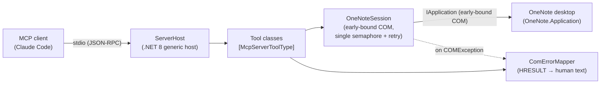
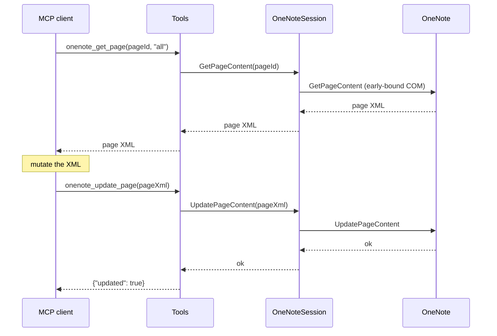
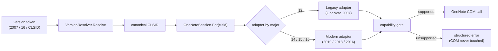
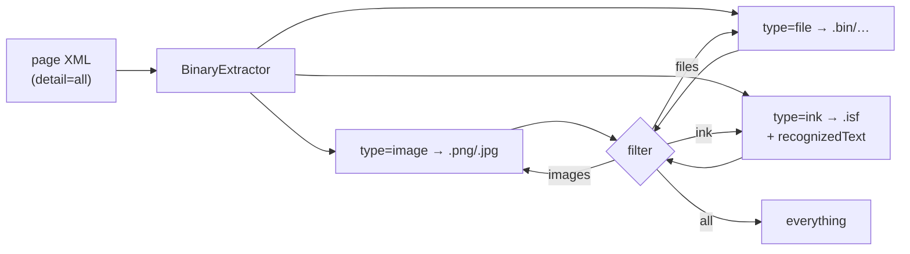
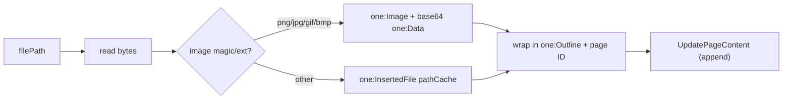

# OneNoteMcp

A [Model Context Protocol](https://modelcontextprotocol.io) server that exposes
Microsoft OneNote (desktop) to MCP clients such as Claude Code. It drives OneNote
through the **early-bound** OneNote COM automation API on Windows, so the OneNote
desktop app must be installed and able to run.

> **Status:** v1 tool surface complete — 21 tools covering diagnostics, hierarchy
> discovery, page read/write, file extraction, notebook/section/page CRUD, and
> PDF/`.one`/`.onepkg` export plus format detection & conversion.

## Architecture

The server is a .NET 8 generic host. It speaks MCP over **stdio** (stdout is
reserved for the protocol; all logs go to stderr). Tools are plain static
methods discovered by attribute and registered automatically. Every COM-touching
call funnels through a single `OneNoteSession` that serialises access to OneNote,
retries transient RPC failures, and recreates the connection if OneNote dies.



A page round-trip edit (read → mutate → write) flows like this:



## Requirements

- Windows with the OneNote **desktop** app installed (the classic Win32
  `OneNote.Application` COM server — not the Store/UWP "OneNote for Windows 10").
- .NET 8 SDK (or a newer SDK able to target `net8.0-windows`). The projects use
  `<RollForward>Major</RollForward>`, so a OneNote-side COM server started under a
  newer runtime works too.

## Multi-version support

Several OneNote desktop generations can be installed side by side (for example
OneNote **2007** and OneNote **2016/2019/365**), and their COM `IApplication`
interfaces are *not* identical — the 2007 (v12) server is missing six methods
added in later releases. To keep routing unambiguous, **every tool takes a
required `version` token as its first parameter**. There is no default and no
implicit "current version" fallback: an empty or unknown token returns a
structured error rather than guessing.

> **Why no default?** Installing OneNote 2007 repoints the version-independent
> `OneNote.Application` ProgID (its `CurVer`) at the 2007 server. Relying on the
> registered default would therefore silently route to whichever version last
> won that registry key. Passing an explicit `version` removes that ambiguity.

Call **`onenote_list_versions`** (the one tool that takes *no* `version` arg) to
discover what is installed — it reports each version's display name, CLSID, exe
path, and the capabilities that version supports.

Accepted tokens: a year (`2007`, `2010`, `2013`, `2016`), an Office major
(`12`, `14`, `16`), or a raw CLSID.



### Capability matrix

Which wrapped `IApplication` method each major supports. 2007 (v12) lacks the six
`IApplication2`–`IApplication4` additions; 2010/2013/2016 support all 23. This
table is verified against `OneNoteCapabilities` by an automated drift-guard test.

| Method | 2007 | 2010 | 2013 | 2016 |
| --- | --- | --- | --- | --- |
| GetHierarchy | ✓ | ✓ | ✓ | ✓ |
| FindPages | ✓ | ✓ | ✓ | ✓ |
| GetPageContent | ✓ | ✓ | ✓ | ✓ |
| UpdatePageContent | ✓ | ✓ | ✓ | ✓ |
| OpenHierarchy | ✓ | ✓ | ✓ | ✓ |
| Publish | ✓ | ✓ | ✓ | ✓ |
| CreateNewPage | ✓ | ✓ | ✓ | ✓ |
| CloseNotebook | ✓ | ✓ | ✓ | ✓ |
| DeleteHierarchy | ✓ | ✓ | ✓ | ✓ |
| UpdateHierarchy | ✓ | ✓ | ✓ | ✓ |
| GetBinaryPageContent | ✓ | ✓ | ✓ | ✓ |
| DeletePageContent | ✓ | ✓ | ✓ | ✓ |
| GetHierarchyParent | ✓ | ✓ | ✓ | ✓ |
| GetSpecialLocation | ✓ | ✓ | ✓ | ✓ |
| NavigateTo | ✓ | ✓ | ✓ | ✓ |
| GetHyperlinkToObject | ✓ | ✓ | ✓ | ✓ |
| FindMeta | ✓ | ✓ | ✓ | ✓ |
| NavigateToUrl | ✗ | ✓ | ✓ | ✓ |
| GetWebHyperlinkToObject | ✗ | ✓ | ✓ | ✓ |
| MergeFiles | ✗ | ✓ | ✓ | ✓ |
| MergeSections | ✗ | ✓ | ✓ | ✓ |
| SyncHierarchy | ✗ | ✓ | ✓ | ✓ |
| SetFilingLocation | ✗ | ✓ | ✓ | ✓ |

Invoking a `✗` method against 2007 returns a structured
`Unsupported on OneNote 2007: '<method>' is not available in this version.`
error — the capability gate rejects it *before* any COM call is made.

## Build & test

```powershell
dotnet build OneNoteMcp.sln
dotnet test OneNoteMcp.sln
```

The integration tests build a fixture notebook in `%TEMP%` via COM and tear it
down per run. To require live COM (fail loudly instead of skipping when OneNote
is unavailable), set `ONENOTE_COM_REQUIRED=1` before `dotnet test`.

## Install from a GitHub Release (no .NET required)

The quickest path: download the self-contained Windows build and point Claude at
it. No .NET SDK, no source checkout, no container.

> This server drives OneNote through **COM**, so it must run as a native process
> on the same Windows desktop where OneNote is installed. That is why it ships as
> a downloadable `.exe` rather than a `docker run ghcr.io/...`-style image — a
> container cannot reach the host's OneNote COM server.

**Step 1 — Download the build.** Grab `OneNoteMcp-v1.0.0-win-x64.zip` from the
[latest release](../../releases/latest) and unzip it anywhere, for example
`C:\Tools\onenote-mcp\`. Note the full path to `OneNoteMcp.exe`.

**Step 2 — Register it with Claude Code, scoped to your user.** Run this in a
terminal (PowerShell or cmd). The `--scope user` (`-s user`) flag makes the
server available in **every** project you open with Claude Code, not just the
current folder:

```powershell
claude mcp add onenote --scope user -- "C:\Tools\onenote-mcp\OneNoteMcp.exe"
```

**Step 3 — Verify.** Confirm it registered and is reachable:

```powershell
claude mcp list          # should list "onenote"
claude mcp get onenote   # shows the command, scope (user), and connection status
```

That's it — start Claude Code and the `onenote_*` tools are available in any project.

### Choosing a scope

`claude mcp add` writes the server config to one of three places depending on
`--scope`:

| Scope | Flag | Stored in | Use when |
| --- | --- | --- | --- |
| **User** (recommended) | `--scope user` / `-s user` | your Claude user config (`~/.claude.json`) | you want OneNote available in **all** your projects on this machine |
| **Local** (default) | *(omit, or `-s local`)* | project-local, private to you | you only want it in the **current** project |
| **Project** | `--scope project` / `-s project` | `.mcp.json` committed in the repo | you want to **share** it with everyone who clones the repo (they still need the exe locally) |

Because this server needs the `OneNoteMcp.exe` present on each machine, **`--scope
user` is the right choice for personal use** — register once, use everywhere.

### Managing or removing it

```powershell
claude mcp remove onenote --scope user   # unregister
claude mcp add onenote --scope user -- "C:\NewPath\OneNoteMcp.exe"   # re-point after moving the exe
```

## Register with Claude Code (from source)

Add this to your project's `.mcp.json` (adjust the path to the checkout):

```json
{
  "mcpServers": {
    "onenote": {
      "command": "dotnet",
      "args": ["run", "--project", "src/OneNoteMcp/OneNoteMcp.csproj"]
    }
  }
}
```

Or register it from the CLI (add `--scope user` to make it available in every
project, as in the release install above):

```powershell
claude mcp add onenote --scope user -- dotnet run --project src/OneNoteMcp/OneNoteMcp.csproj
```

To run a published binary instead of `dotnet run`:

```json
{
  "mcpServers": {
    "onenote": {
      "command": "path\\to\\OneNoteMcp.exe"
    }
  }
}
```

## Tool catalog

All object IDs are OneNote object IDs obtained from the hierarchy tools. All file
outputs are absolute paths. Tools return a string (small JSON literals for
mutations, JSON arrays of paths for exports, raw OneNote XML for reads). COM
failures are **returned** in the tool result as human-readable text (see
[Troubleshooting](#troubleshooting)), never thrown across the protocol.

### Diagnostics

| Tool | Parameters | Returns |
| --- | --- | --- |
| `onenote_diagnostics` | *(none)* | Server version, detected OneNote version, running state, open-notebook count, last error. |

### Hierarchy / discovery

| Tool | Parameters | Returns |
| --- | --- | --- |
| `onenote_list_notebooks` | *(none)* | JSON of open notebooks: `id`, `name`, `path`, flags. |
| `onenote_get_hierarchy` | `nodeId` (empty = root), `scope` (`notebooks`\|`sections`\|`pages`) | Raw OneNote hierarchy XML. |
| `onenote_find_pages` | `query` | Matching pages: `id`, `title`, `sectionId`. |

### Page read

| Tool | Parameters | Returns |
| --- | --- | --- |
| `onenote_get_page` | `pageId`, `detail` (`basic`\|`selection`\|`binaryData`\|`fileType`\|`all`) | Raw OneNote page XML at the requested detail level. |
| `onenote_get_page_info` | `pageId` | Summary metadata: `id`, `title`, timestamps, author, level. |

### Extraction

| Tool | Parameters | Returns |
| --- | --- | --- |
| `onenote_extract_page_files` | `pageId`, `filter` (`images`\|`files`\|`ink`\|`all`), `outputDir?` | JSON array of written file paths (each with `type`, geometry, and `recognizedText` for ink). Omit `outputDir` to write to a temp directory. |
| `onenote_embed_file` | `pageId`, `filePath`, `preferredName?`, `x?`, `y?` | Reads a local file and appends it to the page: images are inlined as base64, other files are attached via `one:InsertedFile`. Supply `x`+`y` to place the new outline. JSON `{kind, format, filePath}`. |

### Page content objects

| Tool | Parameters | Returns |
| --- | --- | --- |
| `onenote_get_binary_page_content` | `pageId`, `callbackId`, `outputDir?` | Decodes a callback-backed binary to disk; JSON `{path, bytes}`. Omit `outputDir` to write to a temp directory. |
| `onenote_delete_page_content` | `pageId`, `objectId` | Deletes a single content object from the page. |

### Notebook / section CRUD

| Tool | Parameters | Returns |
| --- | --- | --- |
| `onenote_open_notebook` | `path` (notebook folder) | `{id}` of the opened notebook. |
| `onenote_create_notebook` | `path` (new folder) | `{id}` of the created notebook. |
| `onenote_close_notebook` | `notebookId` | Closes the notebook (files stay on disk). |
| `onenote_create_section` | `parentId`, `name` | `{id}` of the new section (`.one` appended if absent). |
| `onenote_rename_node` | `id`, `newName` | Renames a section, section group, or notebook. |
| `onenote_delete_node` | `id` | Deletes a section, section group, or notebook. **No confirmation guardrails.** |

### Page CRUD

| Tool | Parameters | Returns |
| --- | --- | --- |
| `onenote_create_page` | `sectionId`, `title?` | `{id}` of the new page. |
| `onenote_update_page` | `pageXml` (full `<one:Page>` carrying the page ID) | Full-page replace; XML validated pre-COM. |
| `onenote_delete_page` | `pageId` | Deletes the page. |

### Export / conversion

| Tool | Parameters | Returns |
| --- | --- | --- |
| `onenote_export_pdf` | `nodeId`, `outputPath`, `mode` (`single`\|`perPage`), `interPublishDelayMs=2000` | JSON array of produced PDF paths. |
| `onenote_export_one` | `sectionId`, `outputPath` | JSON array with the produced `.one` path (current 2010+ format). |
| `onenote_export_onepkg` | `notebookId`, `outputPath` | JSON array with the produced `.onepkg` path (current 2010+ format). |
| `onenote_detect_format` | `pathOrNodeId` (file path or object ID) | JSON report: current 2010+ vs legacy 2007 (header sniff, read-only). |
| `onenote_convert_section` | `sectionId`, `outputPath` | JSON report; best-effort republish to current `.one` format. |

### Navigation & hyperlinks

| Tool | Parameters | Returns |
| --- | --- | --- |
| `onenote_navigate_to` | `hierarchyObjectId`, `objectId?`, `newWindow?` | Navigates the OneNote UI to a node/object. |
| `onenote_navigate_to_url` | `url`, `newWindow?` | Navigates the OneNote UI to a `onenote:` URL. |
| `onenote_get_hyperlink_to_object` | `hierarchyId`, `pageContentObjectId?` | A `onenote:` hyperlink to the node/object. |
| `onenote_get_web_hyperlink_to_object` | `hierarchyId`, `pageContentObjectId?` | A web (https) hyperlink to the node/object. |

### Hierarchy maintenance & filing

| Tool | Parameters | Returns |
| --- | --- | --- |
| `onenote_get_hierarchy_parent` | `objectId` | Object ID of the node's parent. |
| `onenote_get_special_location` | `location` (`backup`\|`unfiledNotes`\|`defaultNotebook`) | Filesystem path of the special location. |
| `onenote_find_meta` | `searchName`, `startNodeId?` | Hierarchy XML of pages matching the metadata name. |
| `onenote_merge_files` | `baseFile`, `clientFile`, `serverFile`, `targetFile` | Three-way merges OneNote files into the target. |
| `onenote_merge_sections` | `sourceId`, `destId` | Merges a source section's pages into the destination. |
| `onenote_sync_hierarchy` | `hierarchyId` | Forces a sync of the node. |
| `onenote_set_filing_location` | `location` (`email`\|`contacts`\|`tasks`\|`meetings`\|`webContent`\|`printOuts`), `locationType` (`namedSectionNewPage`\|`currentSectionNewPage`\|`currentPage`\|`namedPage`), `sectionId` | Sets the Outlook-item filing section. |

> **Not exposed:** `QuickFiling` (surfaces an interactive modal dialog with no
> headless automation surface) and OneNote change events (`OnNavigate` /
> `OnHierarchyChange`, unsupported in managed code) are intentionally omitted.

## OneNote page XML schema

This server does **not** define or bundle its own schema (there is no `.xsd` in
the repo). It works directly against the XML that OneNote's own COM API produces
and accepts — OneNote is the source of truth for the grammar.

- **Reads** (`onenote_get_page`, `onenote_get_hierarchy`, …) return **raw OneNote
  XML** exactly as OneNote emits it. Parsing here is namespace-agnostic (elements
  are matched by local name such as `Page`, `Outline`, `T`, `Image`), so it
  tolerates any OneNote schema generation.
- **Writes** (`onenote_update_page`) take a **full `<one:Page>` document** — a
  full-page replace, not a patch. Before the COM call, a lightweight guard
  (`PageXmlValidator`) checks only that the payload is well-formed, rooted in a
  `<Page>` element in a OneNote schema namespace, and carries an `ID` attribute
  (so the update targets the right page instead of silently creating a new one).
  It does **not** validate the body against the full XSD — OneNote does that.
- The schema **version** is selected per call via an integer OneNote understands
  (`Xs2007=0`, `Xs2010=1`, `Xs2013=2`); every tool uses `Xs2013`.

### The canonical schema

The authoritative grammar is Microsoft's `OneNoteApplication` XML schema (the
`http://schemas.microsoft.com/office/onenote/2013/onenote` namespace), documented
here:

- OneNote XML schema reference:
  <https://learn.microsoft.com/office/client-developer/onenote/onenote-xml-schemas>
- `IApplication` COM interface (the API these tools drive):
  <https://learn.microsoft.com/office/client-developer/onenote/application-interface-onenote>

The most reliable way to see the exact shape for a given element is to create the
content in OneNote and call `onenote_get_page` — the returned XML is a ready-made
template you can mutate and pass back to `onenote_update_page`.

### Minimal valid write payload

A complete, minimal `<one:Page>` accepted by `onenote_update_page` — a title plus
one body text run. The `ID` must be the object ID of the page you are updating
(get it from `onenote_create_page` or the hierarchy tools):

```xml
<one:Page xmlns:one="http://schemas.microsoft.com/office/onenote/2013/onenote"
          ID="{OBJECT-ID-OF-THE-PAGE}">
  <one:Title>
    <one:OE>
      <one:T><![CDATA[My page title]]></one:T>
    </one:OE>
  </one:Title>
  <one:Outline>
    <one:OEChildren>
      <one:OE>
        <one:T><![CDATA[Body text goes here.]]></one:T>
      </one:OE>
    </one:OEChildren>
  </one:Outline>
</one:Page>
```

Text is wrapped in `<![CDATA[...]]>` so markup characters are not interpreted.
Recommended workflow: `onenote_get_page` → mutate the returned XML → send the
whole document back to `onenote_update_page`.

### Inline binaries & ink

At `detail: binaryData` or `all`, OneNote **inlines** every binary object as
base64 inside a `<one:Data>` child — images, inserted files, and **ink**. For
ink specifically, OneNote emits the ISF (Ink Serialized Format) stroke bytes
inline and the `<one:CallbackID>` disappears, so no extra COM round-trip is
needed to retrieve the strokes.

`onenote_extract_page_files` decodes these to disk, typing each one so the
`filter` argument can select a category:

| Carrier element | `type` | Written as | Notes |
| --- | --- | --- | --- |
| `one:Image` | `image` | sniffed ext (`.png`/`.jpg`/…) | `width`/`height` from the `one:Size` child |
| inline-file carrier | `file` | sniffed ext, else `.bin` | any other element with an inline `one:Data` |
| `one:InkDrawing` / `one:InkWord` / `one:InkParagraph` | `ink` | `.isf` | ISF has no magic header, so ink is always `.isf`; `recognizedText` is captured (InkWord), and geometry is read from the carrier's own `width`/`height` attributes when there is no `one:Size` child |

`filter` values: `images`, `files` (**excludes** ink — it is its own category),
`ink`, or `all`.



### Embedding files (the reverse direction)

`onenote_embed_file` takes a **local file path**, reads it server-side, and
appends it to a page — callers never build base64 or page XML. It auto-routes by
type: raster images (`png`/`jpg`/`gif`/`bmp`, decided by extension or magic
sniff) are inlined as base64 in `one:Image`; every other file is attached
natively via `one:InsertedFile`, which references the file **path** on disk (no
base64). Supply `x`+`y` to place the appended outline; omit both to let OneNote
choose. On OneNote 2007 (major 12) the 2007 namespace/schema is emitted.



## Export & format capabilities

- **PDF** — single file for a page/section (`mode: single`), or one PDF per page
  (`mode: perPage`) into a directory. `perPage` waits `interPublishDelayMs`
  between publishes because OneNote can wedge when publishes are hammered.
- **`.one`** — export a section to the current (2010+) OneNote section format.
- **`.onepkg`** — export a whole notebook to a Windows-cabinet package. Publish is
  asynchronous: the server waits for the file to be fully written and unlocked
  before returning the path.
- **Format detection** — reads the file header to classify a `.one`/`.onetoc2`
  file as current 2010+ or legacy 2007 without ever modifying it.

### 2007-format limitations

OneNote 2007 (`FFV27`) files are handled on a **best-effort, COM-only** basis:

- `onenote_detect_format` reliably reports the legacy 2007 format from the header.
- `onenote_convert_section` attempts an upgrade via the Publish API *only if the
  installed OneNote can open the section*, and reports failure per-section rather
  than crashing.
- There is **no binary `.one` parser** in this repo. If your OneNote install
  cannot open a legacy section, this server cannot convert it — upgrade it in
  OneNote directly first.

## Troubleshooting

Errors are returned inside the tool result, made human-readable by a central
`ComErrorMapper` in the form
`OneNote error 0x{HRESULT}: {message} Suggested action: {action}`.

| Symptom | Cause | Fix |
| --- | --- | --- |
| `0x80042030` — OneNote is showing a dialog | A modal (often the first-run / sign-in screen) is blocking automation. | Dismiss the OneNote dialog, then retry. |
| `0x80080005` — OneNote failed to start | COM could not launch OneNote (commonly the first-run screen). | Open OneNote manually, complete first-run/sign-in once, then retry. |
| `0x80042014` / `0x80042004` / `0x80042005` — object/section/page does not exist | The ID is stale (IDs change after a sync). | Refresh IDs via `onenote_list_notebooks` or `onenote_get_hierarchy`. |
| `0x80042010` — page changed since last read | Someone (or a sync) edited the page. | Re-read with `onenote_get_page`, reapply your edit, update again. |
| `0x8004201E` — legacy 2007 section | The section is in the OneNote 2007 format. | Upgrade with `onenote_convert_section` before editing. |
| `0x8004201b` — section encrypted and locked | The section is password-protected. | Unlock it in OneNote, then retry. |
| `0x800706BA` — OneNote process unavailable | OneNote closed or restarted mid-call. | The session reconnects automatically; retry the call. |
| `0x80010001` / `0x8001010A` — busy / retry later | OneNote is busy. | Retry shortly (the session already retries transient failures). |

If **every** integration test fails from the fixture constructor with
`0x80080005`/`0x80042014`, OneNote is stuck on the first-run modal — this is an
environment issue, not a code bug. Complete OneNote's first-run/sign-in once.

## License

[MIT](LICENSE)
